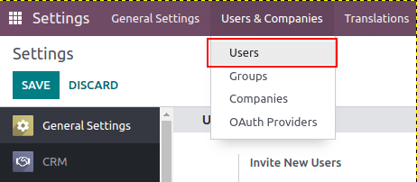
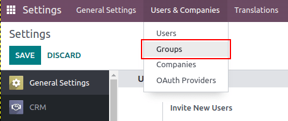

=============
Access Rights
=============

Access rights are permissions that determine what content/applications users can access and edit. In
Odoo, these permissions can be set for individual users or for groups of users. Limiting permissions
to only those who need them ensures that users do not modify or delete anything they should not have
access to. Only an *administrator* can change access rights.

.. important::
   Making changes to access rights can have a detrimental impact on the database. This includes
   impotent admin, this means that no user in the database can make changes to the access rights.
   For this reason, Odoo recommends contacting an Odoo Business Analyst or our Support Team before
   making changes.

.. tip::
   A user must have :guilabel:`Access Rights` under :guilabel:`Administration` access rights in
   order to make changes on another user's access rights settings. To access this setting navigate
   to :menuselection:`Settings app --> Manage users --> User --> Access Rights tab -->
   Administration`. Once at the setting an already existing administrator must change the setting
   under :guilabel:`Administration` to :guilabel:`Access Rights`. :guilabel:`Save` the changes to
   implement the user as an administrator.

Users
=====

The :ref:`Access Rights <users/add-individual>` for individual users are set when the user is added
to the database, but they can be adjusted at any point in the user's profile.

To make changes to a user's rights, first activate Odoo's :ref:`developer mode <developer-mode>`,
then go to :menuselection:`Settings --> Users & Companies --> Users`. Click on the user to edit.

At the user's profile page, click on the :guilabel:`Access Rights` tab and scroll down to view the
current permissions. For each app, use the drop-down menu to select what level of permission this
user should have. The options vary for each section yet the most common are: *Blank/None*, *User:
Own Documents*, *User: All Documents*, or *Administrator*.

Administration includes either :guilabel:`Settings` or :guilabel:`Access Rights`.

.. image:: access_rights/user-permissions-dropdown-menu.png
   :align: center
   :alt: Open the drop-down menu next to each app to set the user's level of permissions.

Creating and modifying groups
=============================

Groups are app-specific sets of permissions that are used to manage common access rights for a large
amount of users. Administrators can modify the existing groups in Odoo or create new ones to define
rules to models within an application.

To access groups, first activate Odoo's :ref:`developer mode <developer-mode>`, then go to
:menuselection:`Settings --> Users & Companies --> Groups`.

To create a new group, click :guilabel:`New`, select an application, and complete the New Group form
(detailed below). To modify existing groups, click on a group and edit the contents of the form.

.. important::
   Always test the settings being changed to ensure they are being applied to the correct users.

The group form contains multiple tabs for managing all elements of the group. In each tab, click
:guilabel:`Add a line` to add a new row for users or rules, and click the :guilabel:`X` icon to
remove a row.

.. image:: access_rights/groups-form.png
   :align: center
   :alt: Click each tab in the groups form to modify the settings of the group.

- :guilabel:`Users` tab: Lists the current users in the group, users listed in black have
  administrative rights. Users without administrative access appear in blue.
- :guilabel:`Inherited` tab: Inherited means that users added to this group are automatically added
  to the groups listed on this tab. For example: If the group *Sales/Administrator* lists the group
  *Website/Restricted Editor* in its Inherited tab, then any users added to the
  *Sales/Administrator* group automatically receive access to the *Website/Restricted Editor* group
  as well.
- :guilabel:`Menus` tab: Defines which menus/models the group can have access to.
- :guilabel:`Views` tab: Lists which views in Odoo the group has access too.
- :guilabel:`Access Rights` tab: Lists the first level of rights (models) that this group has access
  rights to. In this tab, the :guilabel:`Model` column represents the common name of the menu/model,
  and the :guilabel:`Name` column represents the technical name given to the model. For each model,
  enable the following options as appropriate:

  - :guilabel:`Read`: Users can see the object's existing values.
  - :guilabel:`Write`: Users can edit the object's existing values.
  - :guilabel:`Create`: Users can create new values for the object.
  - :guilabel:`Delete`: Users can delete values for the object.

  .. tip::
     First try searching for the common name of the model in the drop-down menu of the
     :guilabel:`Model` column. The :guilabel:`Model` technical name can be found by expanding the
     model common name by clicking the :guilabel:`expand` button.

     The model technical name can also be accessed in :ref:`developer mode <developer-mode>`. On a
     form navigate to any field, and hover over the field name. A box of backend information will
     reveal itself with the specific Odoo :guilabel:`Object` name in the backend. This is the
     technical name of the model that should be added.

- :guilabel:`Record Rules`: Lists the second layer of editing and visibility rights. Record Rules
  overwrite, or refine, the group's *Access Rights*. For each rule, choose values for the following
  options:

  - :guilabel:`Apply for Read`.
  - :guilabel:`Apply for Write`.
  - :guilabel:`Apply for Create`.
  - :guilabel:`Apply for Delete`.

  .. important::
     Record rules are written using a *Domain*, or conditions that filter data. A domain expression
     is a list of such conditions. Users without knowledge of domains and domain expressions should
     consult an Odoo Business Analyst or the Odoo Support Team before making changes.

Superuser mode
==============

*Superuser mode* allows the user to bypass record rules and access rights. To activate *Superuser
mode* first, activate :ref:`developer mode <developer-mode>`. Then navigate to the bug menu in the
top banner. The :guilabel:`🪲 (bug)` menu can be accessed by clicking on the :guilabel:`🪲 (bug)`
icon. Finally, towards the bottom click :guilabel:`Become Superuser`.

.. important::
   Only users with :guilabel:`Settings` access for the Administration section of the *Access Rights*
   are allowed to log in to *Superuser mode*.

.. danger::
   *Superuser mode* allows for circumvention of record rules and access rights, and therefore should
   be exercised with extreme caution. Upon exiting *Superuser mode* users may be locked out of the
   database due to changes that were made. This can cause impotent admin, or an administrator
   without the ability to change access rights/settings. In this case contact Odoo Support here:
   `new help ticket <https://www.odoo.com/help>`_. The support team will be able to restore access
   using a support login.

To leave *Superuser mode*, log out of the account by navigating to the upper right corner and
clicking on the :guilabel:`OdooBot` username, then click :guilabel:`Log out`.

.. tip::
   An alternative to using the :guilabel:`🪲 (bug)` menu to activate *Superuser mode* is to login as
   a superuser. To do so navigate to the login screen and enter the appropriate :guilabel:`Email`
   and :guilabel:`Password`. Instead of clicking :guilabel:`Login`, click :guilabel:`Log in as
   superuser`.
