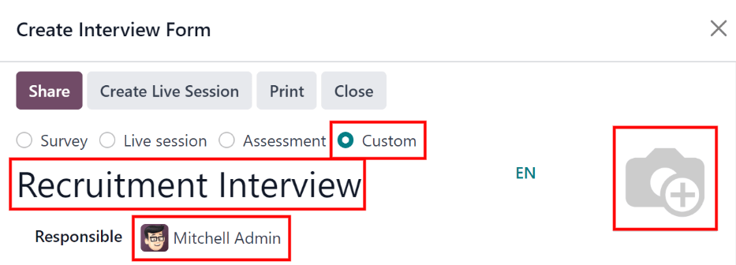
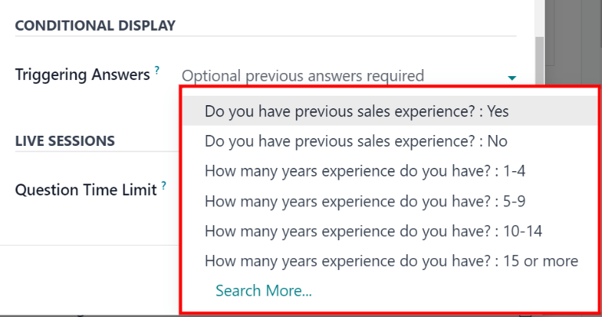
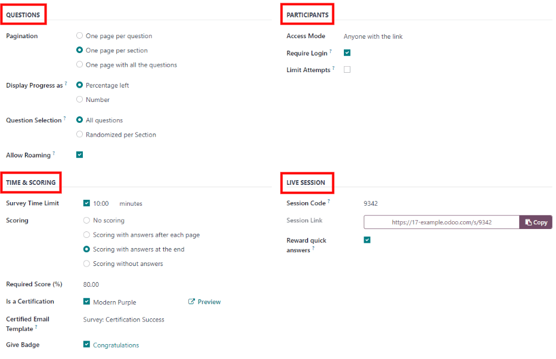

=============
Job positions
=============

In Odoo *Recruitment*, all job positions are shown on the default :menuselection:`Recruitment`
dashboard view. This includes positions being actively recruited for, as well as inactive positions.

Each job position is shown in an individual Kanban card. If the job position is active, and
candidates can apply, a :guilabel:`Published` banner appears in the top-right corner of the card.

View submitted applications by clicking anywhere on a job position card.

.. image:: new_job/jobs.png
   :align: center
   :alt: Main dashboard view of Recruitment showing all job positions.

Create a new job position
=========================

To create a new job position from the main :guilabel:`Recruitment` dashboard, click the
:guilabel:`New` button in the top-left corner, and a :guilabel:`Create a Job Position` pop-up window
appears.

First, enter the name of the position (such as `Sales Manager`, `Mechanical Engineer`, etc.).

Next, enter an :guilabel:`Application email` by typing in the first half of the email address in the
first field, then select the second half of the email using the drop-down menu. Applicants can send
a resumé to this specific email address, and Odoo creates an application for them automatically.

When complete, click the :guilabel:`Create` button to save the entry, or the :guilabel:`Discard`
button to delete it.

.. image:: new_job/job-title.png
   :align: center
   :alt: Create a new job position.

Once the job position has been created, it appears as a card in the Kanban view on the main
:guilabel:`Recruitment` dashboard.

Edit a new job position
-----------------------

After the job position is created, it's time to enter the details for the position. Click on the
:guilabel:`⋮ (three dots)` icon in the upper-right corner of the relevant card to reveal several
options, and then click :guilabel:`Configuration` to edit the details.

.. image:: new_job/edit-job.png
   :align: center
   :alt: Edit the job position card.

All the basic information about the job position is listed under the :guilabel:`Recruitment` tab.

None of the fields are required, but it is important to configure and populate at a minimum the
:guilabel:`Department`, :guilabel:`Location`, :guilabel:`Employment Type`, and :guilabel:`Job
Summary` fields, as they are all visible to prospective applicants on the website.

The fields can be filled out as follows:

- :guilabel:`Department`: select the relevant department for the job position. This is visible on
  the website.
- :guilabel:`Job Location`: select the physical address for the job. If the job position is remote,
  leave this field blank. This is visible on the website.
- :guilabel:`Email Alias`: enter an email address that applicants can send a resumé  to. Once
  emailed, Odoo automatically creates an application for them.
- :guilabel:`Employment Type`: select what type of position the job is, using the drop-down menu.
  The default options are :guilabel:`Permanent`, :guilabel:`Temporary`, :guilabel:`Seasonal`,
  :guilabel:`Interim`, :guilabel:`Full-Time`, and :guilabel:`Part-Time`. This is visible on the
  website.
- :guilabel:`Company`: select the company the job is for. This field only appears if using a
  multi-company database.
- :guilabel:`Target`: enter the number of employees to be hired for this position.
- :guilabel:`Is Published`: activate this option to publish the job online.
- :guilabel:`Website`: select the website the job is published on.
- :guilabel:`Recruiter`: select the person responsible for recruiting this role.
- :guilabel:`Interviewers`: select who should perform the interviews. Multiple people can be
  selected.
- :guilabel:`Interview Form`: select an :ref:`Interview form <interview>` that applicants fill out
  prior to their interview.
- :guilabel:`Contract Template`: select a contract template to be used when offering the job to a
  candidate.
- :guilabel:`Process Details` section: this section contains information that is displayed online
  for the job position. This informs the applicants of the timeline and steps for the recruitment
  process, so they know when to expect a reply.

  - :guilabel:`Time to Answer`: enter the number of days before the applicant is contacted.
  - :guilabel:`Process`: enter the various stages the candidate goes through during the recruitment
    process.
  - :guilabel:`Days to get an Offer`: enter the number of days before the applicant should expect
    an offer after the recruitment process has ended.

.. note::
   The :guilabel:`Process Details` section is a text field. All answers are typed in rather than
   selected from a drop-down menu. The text is displayed on the website exactly as it appears in
   this tab.

Finally, enter the job description in the :guilabel:`Job Summary` tab.

.. image:: new_job/recruitment-tab.png
   :align: center
   :alt: Enter job information details in the recruitment tab.

.. _interview:

Create interview form
---------------------

An *Interview Form* is used to determine if a candidate is a good fit for a job position. Interview
forms can be as specific or general as desired, and can take the form of a certification, an exam,
or a general questionnaire. Interview forms are determined by the recruitment team.

Before creating an interview form, ensure the proper settings are enabled. Navigate to
:menuselection:`Recruitment app --> Configuration --> Settings`, and under the
:guilabel:`Recruitment Process` section, ensure the :guilabel:`Send Interview Survey` option is
enabled.

Since there are no pre-configured forms in Odoo, all interview forms must be created. To create an
interview form, start from the :guilabel:`Recruitment` tab of the :guilabel:`Job Position` form. In
the :guilabel:`Interview Form` field, enter a name for the new interview form. As the name is typed,
several options populate beneath the entry: :guilabel:`Create (interview form name)`,
:guilabel:`Search More...`, and :guilabel:`Create and edit...`. Click :guilabel:`Create and edit...`
and a :guilabel:`Create Interview Form` pop-up window appears.

.. note::
   The option :guilabel:`Search More...` only appears if there are any interview forms already
   created. If no interview forms exist, the only options available are :guilabel:`Create (interview
   form name)`, and :guilabel:`Create and edit...`.

First, enter a name for the form in the :guilabel:`Name` field. This should be indicative of when
the form should be used. For example, is the form specific to a job position, or is it a general
form that can be used for all recruitment scenarios?

Next, select the kind of interview form being created. The default is :guilabel:`Custom`, which is
pre-selected. The various options are :guilabel:`Survey`, :guilabel:`Live session`,
:guilabel:`Assessment`, and :guilabel:`Custom`.

Next, select the person responsible for the form using the drop-down menu in the
:guilabel:`Responsible` field.

If desired, an image can be added to the interview form. Mouse over the camera icon on the far right
and a :guilabel:`✏️ (pencil)` icon appears. Click the :guilabel:`✏️ (pencil)` icon and a file
explorer window appears. Navigate to the desired image file, then click :guilabel:`Open` to select
it.

Questions
~~~~~~~~~

In the :guilabel:`Questions` tab, click on :guilabel:`Add a section` to add a section to the form. A
line appears, and a section heading can be entered. When complete, click off the line, or press
enter to lock in the new section on the form.

Next, click :guilabel:`Add a question` to add a question to the section. A :guilabel:`Create
Sections and Questions` pop-up window appears where the question details are entered. Type out the
question in the top line.

There are several :guilabel:`Question Types` to choose from:

- :guilabel:`Multiple choice: only one answer`: a multiple choice question that only allows the
  candidate to select one answer
- :guilabel:`Multiple choice: multiple answers allowed`: a multiple choice question that allows the
  candidate to select multiple answers
- :guilabel:`Multiple Lines Text Box`: allows the applicant to enter several lines of text
- :guilabel:`Single Line Text Box`: limits the applicant to only a single line of text
- :guilabel:`Numerical Value`: only allows a number to be entered
- :guilabel:`Date`: a calendar module is presented to select a date
- :guilabel:`Datetime`: a calendar module and a clock icon is presented to select a date and time
- :guilabel:`Matrix`: a customizable table that allows the candidate to choose an answer for each
  row

After selecting a question type, a sample question appears in gray. This represents how the question
will be displayed to applicants.

.. image:: new_job/questions.png
   :align: center
   :alt: Add a new question to the interview form.

Questions and sections can be reorganized. Move them by clicking and dragging individual section
headings or question lines to their desired position(s).

Sections are indicated by a gray background, while questions have a white background.

.. image:: new_job/questions-matrix.png
   :align: center
   :alt: A sample of categories and questions for a candidate.

Answers
*******

If :guilabel:`Multiple choice: only one answer`, :guilabel:`Multiple choice: multiple answers
allowed`, :guilabel:`Single Line Text Box`, or :guilabel:`Matrix` is selected for the
:guilabel:`Question Type`, an :guilabel:`Answers` tab appears beneath the question. If another
question type is selected, the :guilabel:`Answers` tab remains hidden from view.

.. tabs::

   .. tab:: Multiple choice

      For both the :guilabel:`Multiple choice: only one answer` and :guilabel:`Multiple choice:
      multiple answers allowed` question type, the answers are populated in the same way.

      First, in the :guilabel:`Answers` tab, click :guilabel:`Add a line`. A line appears, and an
      answer can be entered. After typing in the answer, click off the line, or press enter to lock
      in the new answer on the form and have another answer line appear.

      If desired, an image can be attached to the answer. Click on a line to select it, and an
      :guilabel:`Upload your file` button appears on the right side. Click the :guilabel:`Upload
      your file` button and a file explorer window appears. Navigate to the image file, select it,
      then click :guilabel:`Open` to select it.

      Repeat this for all the answers to be added for the multiple choice question. The answers can
      be rearranged in any order. To move an answer, click on the six small squares on the far left
      of each answer line, and drag the answer to the desired position. The order the answers appear
      in the form is the order the answers will appear online.

      To delete a line, click on the :guilabel:`🗑️ (trash can)` icon on the far right side of the
      answer line.

      .. image:: new_job/multi-answers.png
         :align: center
         :alt: Answers to a multiple choice question, where each line has a different answer listed.

   .. tab:: Single Line Text Box

      If the :guilabel:`Single Line Text Box` question type is selected, only two checkboxes appear
      in the :guilabel:`Answers` tab:

      - :guilabel:`Input must be an email`: activate this option if the answer must be in the format
        of an email address.

        - :guilabel:`Save as user email?`: this option appears if :guilabel:`Input must be an email`
          is selected. This saves the email entered on the form as the user's email, and will be
          used anytime Odoo contacts the user via email.

      - :guilabel:`Save as user nickname?`: activate this option to populate the answer as the
        user's nickname. This is stored and used anywhere Odoo uses a nickname.

      .. image:: new_job/single-line.png
         :align: center
         :alt: The three possible checkboxes that can appear if a single line of text is selected
               for the question type.

   .. tab:: Matrix

      Sometimes, a question is asked that does not fit a standard answer format, and is best suited
      for a matrix. For example, asking an applicant what is their availability to work compared to
      the various shifts is a perfect question for a matrix format. In this example, an applicant
      can click on all the shifts they are available to work.

      For a :guilabel:`Matrix` question type, there are two sets of data that need to be input. The
      rows and columns must both be configured. The columns are represented by the
      :guilabel:`Choices` section, while the rows are configured in the :guilabel:`Rows` section.

      The method for populating both sections is the same. In the :guilabel:`Answers` tab, click
      :guilabel:`Add a line` in either the :guilabel:`Choices` or :guilabel:`Row` section. A line
      appears, and an answer can be entered. After typing in the answer, click off the line, or
      press enter on the keyboard to lock in the new answer on the form and have another answer line
      appear. Repeat this for all answers for both the :guilabel:`Choices` and :guilabel:`Rows`
      sections.

      .. example::
         This is a matrix that asks an applicant what shifts they are available to work on Saturdays
         and Sundays only, and the available options for those two days are either morning,
         afternoon, or evening.

         .. figure:: new_job/matrix.png
            :align: center
            :alt: A matrix set up to ask about availability on Saturday and Sunday mornings,
                  afternoons, and evenings.

Description
***********

Enter any information that may be helpful to an applicant. This description will appear for this
specific question only, and therefore should be question-specific and not generalized.

Options
*******

To view the options that are available to set for a question, click on the :guilabel:`Options` tab.
The various sections are :ref:`Answers <answers>`, :ref:`Conditional Display <conditional>`,
:ref:`Constraints <constraints>`, and :ref:`Live Sessions <live>`.

.. _answers:

Answers
^^^^^^^

- :guilabel:`Show Comments Field`: this field only appears if either :guilabel:`Multiple choice:
  only one answer`, :guilabel:`Multiple choice: multiple answers allowed`, or :guilabel:`Matrix` is
  selected for the :guilabel:`Question Type`.

  Activate this option to display a comment to accompany the question. The :guilabel:`Comment
  Message` and :guilabel:`Comment is an answer` fields appear if activated. Enter the text to appear
  in the :guilabel:`Comment Message` field. This should be helpful to the applicant when answering
  the question, such as `If other, please specify`.

  Last, if the comment should be logged as the applicant's answer, activate the :guilabel:`Comment
  is an answer` box.
- :guilabel:`Placeholder`: this field only appears if either :guilabel:`Multiple Lines Text Box`,
  :guilabel:`Single Line Text Box`, :guilabel:`Numerical Value`, :guilabel:`Date`, or
  :guilabel:`Datetime` are selected for the :guilabel:`Question Type`.

  Enter any text in the :guilabel:`Placeholder` field to provide any additional information or
  directions to assist the applicant.
- :guilabel:`Validate entry`: this field only appears if either :guilabel:`Single Line Text Box`,
  :guilabel:`Numerical Value`, :guilabel:`Numerical Value`, :guilabel:`Date`, or
  :guilabel:`Datetime` are selected for the :guilabel:`Question Type`.

  Activate the :guilabel:`Validate entry` option if what the applicant enters must be a numerical
  value or a date, *and* needs to be verified. The answer can **only** be verified if it is a
  numerical value or a date.

  When activated, several other options appear. Enter the values for the :guilabel:`Min/Max Limits`
  in the corresponding two fields.

  Next, in the :guilabel:`Validation Error` field, enter the text that appears when the answer given
  does not fit within the designated minimum and maximum parameters.
- :guilabel:`Matrix Type`: this field only appears if :guilabel:`Matrix` is selected for the
  :guilabel:`Question Type`.

  Using the drop-down menu, select either :guilabel:`One choice per row` or :guilabel:`Multiple
  choices per row`.

.. _conditional:

Conditional display
^^^^^^^^^^^^^^^^^^^

If the question should only appear if a previous question is answered in a specific way, configure
the :guilabel:`Triggering Answers` option under :guilabel:`Conditional Display`.

Using the drop-down menu, select a previous question and corresponding answer that must be selected
for this new question to appear.

Any question in the current survey with a selectable answer is listed as an available option in the
:guilabel:`Triggering Answers` drop-down menu.

.. example::
   To further illustrate the :guilabel:`Conditional Display` section, the following is an example
   that is applicable to recruitment.

   The question `Do you have experience with managing a sales team?` is already added. The question
   `How many years of experience?` is added next.

   This question should **only** appear if the applicant selected `Yes` to the question `Do you have
   prior experience managing a sales team?`.

   To properly configure this example, select `Do you have experience with managing a sales team? :
   Yes` as the :guilabel:`Triggering Answer`.

.. _constraints:

Constraints
^^^^^^^^^^^

If the question is required to be answered by the applicant, activate the :guilabel:`Mandatory
Answer` option. An :guilabel:`Error message` field appears, with some example text in gray (*This
question requires an answer*).

Enter the message that should appear if the applicant attempts to move on to the next question
without answering this required one. The text should explain that the question **must** be answered.

.. _live:

Live sessions
^^^^^^^^^^^^^

If the question is being answered during a live session, activate the :guilabel:`Question Time
Limit` option. A :guilabel:`seconds` field appears. Enter the amount of time allotted for the
applicant to enter the answer, in seconds.

Options
~~~~~~~

Next, configure the various options for the interview form. Click the :guilabel:`Options` tab to
view all the options to configure, by category.

Questions
*********

This section determines which questions are displayed to the applicant, and in what manner they are
displayed.

- :guilabel:`Pagination`: choose how the questions should be displayed. The options are:

  - :guilabel:`One page per question`: display a single question on each page.
  - :guilabel:`One page per section`: display each section with the corresponding questions on an
    individual page.
  - :guilabel:`One page with all the questions`: display all sections and questions at the same
    time.

- :guilabel:`Display Progress as`: choose how to display the percentage of questions remaining to
  be answered. This option only appears if either :guilabel:`One page per question` or
  :guilabel:`One page per section` is selected for :guilabel:`Pagination`. The options are:

  - :guilabel:`Percentage left`: display the remaining amount in a percentage (%).
  - :guilabel:`Number`: display the remaining amount in a numerical value.

- :guilabel:`Question Selection`: choose which questions are presented to the applicant. The options
  are:

  - :guilabel:`All questions`: display the entire form, with all questions from all sections.
  - :guilabel:`Randomized per Section`: display only a random selection of questions from each
    section.

- :guilabel:`Allow Roaming`: activate this option if the applicant is able to click a back button to
  go back to previous questions.

.. note::
   Although it is a selectable option, the :guilabel:`Randomized per section` option should only be
   used if receiving partial information/an incomplete survey from every applicant is acceptable.

Participants
************

This section determines who can access the interview form, and what kinds of restrictions are
imposed.

- :guilabel:`Access Mode`: specify who can access the interview form. The available options are
  either :guilabel:`Anyone with the link` or :guilabel:`Invited people only`.
- :guilabel:`Require Login`: activate this option to require candidates to log in before accessing
  the interview form, whether they have a valid token or not.
- :guilabel:`Limit Attempts`: if there is a limit to how many times someone can attempt to login to
  the interview form, activate this box. When activated, an :guilabel:`attempts` field appears.
  Enter the maximum number of login attempts in the field.

Time & scoring
**************

This section determines how long candidates have to complete an interview form, and how the form is
scored, if at all.

- :guilabel:`Survey Time Limit`: activate this option to limit the time allowed to complete the
  interview form. When selected, a :guilabel:`minutes` field appears next to it. Enter the allotted
  time for the interview form in the field, using an XX:XX minute/second format.
- :guilabel:`Scoring`: choose how the interview form should be scored. The options are:

  - :guilabel:`No scoring`: select this option to not score the form.
  - :guilabel:`Scoring with answers after each page`: select this option to score the interview form
    and display the correct answers for the candidate as they finish each page.
  - :guilabel:`Scoring with answers at the end`: select this option to score the interview form and
    display the correct answers for the candidate after they have completed the interview form.
  - :guilabel:`Scoring without answers`: select this option to score the interview form but not
    display the answers to the candidate.

- :guilabel:`Required Score (%)`: this option appears if one of the scoring options was selected.
  Enter the percentage the candidate needs to pass the interview form (e.g., 80.00%). The entry
  should be written in an `XX.XX` format.

- :guilabel:`Is a Certification`: activate this option if the interview form is a certification
  exam. When activated, a drop-down menu appears next to the checkbox. Select one of the default
  formats for the PDF certificate that is sent to the candidate after completing and passing the
  certification exam. Click the :guilabel:`Preview` button to view an example of the PDF
  certificate.
- :guilabel:`Certified Email Template`: if the :guilabel:`Is a Certification` box is activated, a
  :guilabel:`Certified Email Template` appears. Using the drop-down menu, select the email template
  form to be used when the applicant passes the exam. Click the :guilabel:`Internal Link` arrow to
  the right of the email template to preview the email.
- :guilabel:`Give Badge`: if the applicant should receive a badge if they successfully pass the
  interview form, activate the :guilabel:`Give Badge` option. This option only appears if the
  :guilabel:`Require Login` option is enabled. Select a badge from the drop-down menu. This badge is
  displayed in the user's portal.

Live session
************

This section contains all the information needed to conduct the interview form live, online. This
section is only necessary to configure if the exam is live.

- :guilabel:`Session Code`: enter the access code that allows the applicants into the live exam
  session.
- :guilabel:`Session Link`: the link to the live exam appears in a box next to the
  :guilabel:`Session Link` option. Click the :guilabel:`Copy` button to copy the link.
- :guilabel:`Reward quick answers`: activate this option to award more points to participants who
  answer quickly.

Description
~~~~~~~~~~~

When the applicant begins the survey, the text entered in this tab appears at the top of the survey
page. Enter any information or descriptions that would be helpful to the applicant.

End message
~~~~~~~~~~~

After the survey is complete, the message entered in this tab is displayed for the applicant.

Additional options
~~~~~~~~~~~~~~~~~~

Once the interview form has been configured, there are several options available: :ref:`Share
<share>`, :ref:`Create Live Session <live-session>`, :ref:`Test <test>`, and :ref:`Print <print>`

.. _share:

Share
*****

The interview form can be shared with applicants. Typically, this is done directly from the
applicant form, but the survey can also be shared in this view.

To send the form to a candidate, click the :guilabel:`Share` button in the top-left corner of the
survey form. A :guilabel:`Share a Survey` pop-up window appears.

First, select the :guilabel:`Recipients` using the drop-down menu. Multiple selections can be made
in this field. The :guilabel:`Subject` field auto-populates with `Participate to (name of survey)`
but can be modified, if desired.

If any attachments need to be sent with the email, click the :guilabel:`Attachments` button. A file
explorer pop-up window appears. Navigate to the file to add, then click :guilabel:`Open` to select
it and attach it to the email.

If there is a deadline for the survey to be completed, enter the date in the :guilabel:`Answer
deadline` field. Click the field to the right of :guilabel:`Answer deadline` and a calendar pop-up
window appears. Navigate to the desired date and click on the day to select it.

Next, select the time using the two drop-down fields, one for the hours, one for the minutes.
Finally, click :guilabel:`Apply` to select both the date and time.

The email template being used is populated in the :guilabel:`Mail Template` field. The email
template can be changed by selecting another template from the drop-down menu.

.. note::
   Changing the :guilabel:`Mail Template` does **not** change any other part of the email pop-up
   window. Only the email body changes if another email template is selected.

When the email is properly configured, click :guilabel:`Send` to send the interview.

.. _live-session:

Create live session
*******************

To create a live online session where participants can complete the interview form in real-time,
click the :guilabel:`Create Live Session` button in the top-left of the survey form.

The interview survey loads in a new tab. In this tab, several items appear:

- :guilabel:`Attendees`: before anyone is logged in to take the interview survey, a
  :guilabel:`Waiting for attendees...` box appears on the screen. As attendees log in, the box is
  updated with the number of attendees, and the text reads :guilabel:`Attendees`.
- :guilabel:`QR Code`: the QR code that appears on the screen takes users to the main website, where
  they can log in to take the interview survey.
- :guilabel:`Start`: once all the attendees have logged in and are ready to begin the interview
  survey, click the :guilabel:`Start` button to begin the interview survey and start the timer.

Once the :guilabel:`Create Live Session` button has been clicked, a :guilabel:`Close Live Session`
button appears in its place, as well as a :guilabel:`See results` button. To end the live session,
click the :guilabel:`Close Live Session` button.

To see all the results from the participants, click the :guilabel:`See results` button. A new tab
loads with all the results. This page displays all the questions, as well as both the number of
responses for each question and the number of participants who skipped each question.

.. _test:

Test
****

Before sending an interview form to an applicant, it is best to test the form to ensure everything
appears correctly, and there are no errors or mistakes in the document.

To test the interview form, click the :guilabel:`Test` button in the top-left of the survey form.

The interview survey opens in a new tab, and appears exactly the same way it will for applicants.

Navigate through the survey to check everything. When the survey has been thoroughly checked, close
the tab.

.. _print:

Print
*****

In some cases, it may be necessary or beneficial to print the interview survey instead of sending it
electronically. To print a copy of the survey, click the :guilabel:`Print` button in the top-left of
the survey form.

The survey loads in a new tab. From here, the survey can be printed or saved as a PDF.
