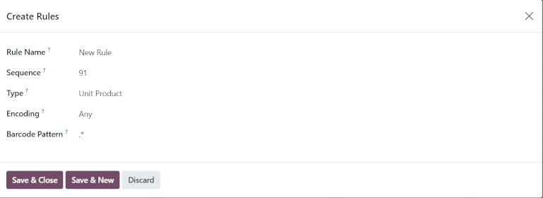

============================
Default barcode nomenclature
============================

.. |UPC| replace:: :abbr:`UPC (Universal Product Code)`
.. |EAN| replace:: :abbr:`EAN (European Article Number)`
.. |GTIN| replace:: :abbr:`GTIN (Global Trade Item Number)`
.. |GTINs| replace:: :abbr:`GTINs (Global Trade Item Numbers)`

*Barcode nomenclatures* define how barcodes are recognized and categorized. When a barcode is
scanned, it is associated to the **first** rule with a matching pattern. The pattern syntax is that
of a regular expression, and a barcode is matched if the regular expression matches a prefix of the
barcode.

Odoo *Barcode* supports UPC (Universal Product Code), EAN (European Article Number), and GS1
encoding. The pre-configured nomenclatures in Odoo are *Default Nomenclature* and *Default GS1
Nomenclature*. The default nomenclature uses |UPC| and |EAN| encoding, and supports |UPC|/|EAN|
conversion.

.. important::
   |UPC| and |EAN| barcodes **must** be `purchased from GS1
   <https://www.gs1.org/standards/get-barcodes>`_ to use these barcodes. GS1 is the **only**
   official provider of |UPC|/|EAN| barcodes globally (as well as GS1 |GTINs|).

.. _barcode/operations/set-up-nomenclature:

Set up barcode nomenclature
===========================

To use default nomenclature, navigate to :menuselection:`Inventory app --> Configuration -->
Settings`. Under the :guilabel:`Barcode` section, click the checkbox next to :guilabel:`Barcode
Scanner` to enable barcodes. Doing so installs the *Barcode* app in the database.

Next, ensure that the :guilabel:`Default Nomenclature` setting is selected in the :guilabel:`Barcode
Nomenclature` field.

.. image:: barcode_nomenclature/barcode-nomenclature-enabled-setting.png
   :align: center
   :alt: Enabled barcode setting with Default Nomenclature selected.

The list of *rules* and *barcode patterns* Odoo supports for the default nomenclature is accessible
by clicking the :guilabel:`➡️ (arrow)` icon to the right of the :guilabel:`Barcode Nomenclature`
selection.

In the :guilabel:`Open: Nomenclature` pop-up table, view and edit the default :guilabel:`Rule Names`
available in Odoo. The table contains all the information that can be condensed with a |UPC|/|EAN|
barcode, along with the corresponding :guilabel:`Barcode Pattern`.

.. tip::
   The :menuselection:`Barcode Nomenclatures` settings can also be accessed by a hidden menu that's
   discoverable after enabling :ref:`developer mode <developer-mode>`. Once enabled, navigate to
   :menuselection:`Inventory app --> Configuration --> Barcode Nomenclatures` menu, and select
   :guilabel:`Default Nomenclature`.

.. _barcode/operations/use-upc-ean-barcodes:

Use UPC/EAN barcodes in Odoo
============================

For product identification using |UPC|/|EAN| barcodes in Odoo, businesses obtain `barcodes
<https://www.gs1us.org/upcs-barcodes-prefixes/how-to-get-a-upc-barcode>`_ purchased directly from
GS1.

The |UPC| and |EAN| barcode formats are predominantly used in their own regions. |UPC| is used only
in the United States and Canada, while |EAN| is used everywhere else globally.

A |UPC| is usually a 12-digit barcode used to identify most products, while |EAN| barcodes use
13-digit barcodes to identify products.

|UPC| codes can be converted to |EAN| by prefixing them with a zero. In Odoo, by default,
|UPC|/|EAN| barcodes are automatically converted one way or another when trying to match a rule with
the other encoding.

Refer to the :ref:`default nomenclature list <barcode/operations/default-nomenclature-list>` to see
a comprehensive list of all barcode patterns and rules to follow.

Create rules
------------

|UPC| and |EAN| barcodes contain information in the barcode. Scanning these codes from the
:ref:`default nomenclature list <barcode/operations/default-nomenclature-list>` automatically fills
corresponding data in the Odoo database.

Adding new barcode rules to this list ensures that non-standard (:dfn:`user-created`) formats are
interpreted accurately.

To create new rules, first activate :ref:`developer mode <developer-mode>`. Then, navigate to
:menuselection:`Inventory app --> Configuration --> Barcode Nomenclatures`. Select the
:guilabel:`Default Nomenclature` list item.

On the :guilabel:`Default Nomenclature` page, select :guilabel:`Add a line` at the bottom of the
table, which opens a window to create a new rule.

The :guilabel:`Rule Name` field is used internally to identify what the barcode represents. The
barcode :guilabel:`Types` are different classifications of information that can be understood by the
system (e.g., Package, Lot, Location, Coupon, etc.). The :guilabel:`Sequence` represents the
priority of the rule; this means the smaller the value, the higher the rule appears on the table.

Odoo follows the sequential order of this table, and will use the first rule it matches based on the
sequence. The :guilabel:`Barcode Pattern` is how the sequence of letters or numbers is recognized by
the system to contain information about the product.

.. note::
   Barcode patterns can also define how numerical values, such as weight or price, are encoded in
   the barcode.

   They are indicated by **{NNN}**, where N defines where the number's digits are encoded. *Floats*
   are also supported with the decimals, indicated by D, such as **{NNNDD}**.

   In this case, the barcode field on the associated records **must** show these digits as zeroes.

After filling in the information, click the :guilabel:`Save & New` button to make another rule, or
click :guilabel:`Save & Close` to save and return to the table of rules.

.. tip::
   When the :guilabel:`Barcode Pattern` field contains `.*`, it means that it can contain **any**
   number of characters, those characters being **any** number.

.. _barcode/operations/default-nomenclature-list:

Default nomenclature list
=========================

The table below contains Odoo's list of default nomenclature rules. Barcode patterns are written in
regular expressions.

.. list-table::
   :header-rows: 1
   :stub-columns: 1

   * - Rule Name
     - Type
     - Encoding
     - Barcode Pattern
   * - Price Barcodes 2 Decimals
     - Priced Product
     - EAN-13
     - 23.....{NNNDD}
   * - Discount Barcodes
     - Discounted Product
     - Any
     - 22{NN}
   * - Weight Barcodes 3 Decimals
     - Weighted Product
     - EAN-13
     - 21.....{NNDDD}
   * - Customer Barcodes
     - Client
     - Any
     - 042
   * - Coupon & Gift Card Barcodes
     - Coupon
     - Any
     - 043|044
   * - Cashier Barcodes
     - Cashier
     - Any
     - 041
   * - Location barcodes
     - Location
     - Any
     - 414
   * - Package barcodes
     - Package
     - Any
     - PACK
   * - Lot barcodes
     - Lot
     - Any
     - 10
   * - Magnetic Credit Card
     - Credit Card
     - Any
     - %.*
   * - Product Barcodes
     - Unit Product
     - Any
     - .*
