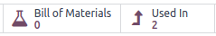

============
Product type
============

.. |BOM| replace:: :abbr:`BoM (Bill of Materials)`

Define *product types* in Odoo to determine how the database keeps track of the product.

.. seealso::
   `Odoo Tutorials: Product Type <https://www.youtube.com/watch?v=l6j0ZkP5mLM>`_

Set product type
================

To set a product type, go to to :menuselection:`Inventory app --> Products --> Product` and
selecting the desired product.

On the product form, in the :guilabel:`Product Type` field, select:

- :guilabel:`Storable` for products tracked with stock counts. Only storable products can trigger
  reordering rules for generating purchase orders.

.. tip::
   Choose :guilabel:`Storable` if it is necessary to track a product's stock at various locations,
   inventory valuation, or lots and serial numbers.

- :guilabel:`Consumable` are items always assumed to be in stock, but with untracked and
  unforecasted quantities. Examples include nails, toilet paper, and coffee—replaceable, essential,
  but exact counts are unnecessary
- :guilabel:`Service` are products are services performed by the business that is for sale (e.g.
  maintenance, installation, repair)

.. image:: type/product-form.png
   :align: center
   :alt: Set a product type on the product form.

.. note::
   The product types listed above are part of the standard *Inventory* app. For access to the fields
   below, install the corresponding apps **in addition** to *Inventory*.

   To install additional applications, navigate to :menuselection:`Apps` and select the
   :guilabel:`Activate` button to install the desired apps or modules.

- :guilabel:`Booking Fees`: charge a fee for booking appointments through the *Calendar* and
  *Appointment* apps. Requires the :guilabel:`Pay to Book` module to be installed
- :guilabel:`Combo`: create discounted products sold in a bundle, available with the *POS* app
  installed
- :guilabel:`Event Ticket`: sell tickets to attend an event. Requires installation of the *Events*
  app
- :guilabel:`Event Booth`: charge customers for setting up a booth. Requires installation of the
  *Events* app
- :guilabel:`Course`: sell access to an educational course. Requires installation of the *eLearning*
  app.

Compare types
=============

Below is a summary of how each product type affects common *Inventory* operations, like transfers,
reordering rules, and the forecasted report. Click the chart item with an asterisk(*) to navigate to
detailed sections.

.. list-table::
   :header-rows: 1
   :stub-columns: 1

   * - Product type
     - Storable
     - Consumable
     - Service
   * - Physical product
     - Yes
     - Yes
     - No
   * - On-hand quantity
     - :ref:`Yes* <inventory/product_management/on-hand-store>`
     - :ref:`Yes* <inventory/product_management/on-hand-con>`
     - No
   * - :doc:`Inventory valuation
       <../../warehouses_storage/inventory_valuation/using_inventory_valuation>`
     - Yes
     - No
     - No
   * - Create transfer
     - :ref:`Yes* <inventory/product_management/transfer-store>`
     - :ref:`Yes* <inventory/product_management/transfer-con>`
     - :ref:`No* <inventory/product_management/transfer-serv>`
   * - :doc:`Lot/serial number tracking <differences>`
     - Yes
     - No
     - No
   * - Appears on :doc:`Replenishment report <../product_replenishment/strategies>`
     - Yes
     - :ref:`No* <inventory/product_management/replenish>`
     - No
   * - Can be manufactured or subcontracted
     - :ref:`Yes* <inventory/product_management/manufacture>`
     - :ref:`Yes* <inventory/product_management/manufacture>`
     - No
   * - Can be in a kit
     - Yes
     - Yes
     - No
   * - Placed in package
     - Yes
     - :ref:`Yes* <inventory/product_management/package>`
     - No
   * - Appears on Inventory report
     - Yes
     - No
     - No

.. _inventory/product_management/on-hand-store:

On-hand quantity
----------------

A storable product's on-hand and forecasted quantity based on incoming and outgoing orders are
reflected on the product form, accessed by going to :menuselection:`Inventory app --> Products -->
Products`.

.. figure:: type/on-hand.png
   :align: center
   :alt: Show "On Hand" and "Forecast" smart buttons.

   Current and forecasted quantities displayed in the **On Hand** and **Forecasted** smart buttons
   on the product form.

.. _inventory/product_management/on-hand-con:

On the other hand, consumable products are regarded as always available, and they cannot be managed
using reordering rules or lot/serial numbers.

.. _inventory/product_management/transfer-store:

Create transfer
---------------

*Transfers* are any warehouse operation, such as receipts, internal or batch transfers, or
deliveries.

When creating a transfer for storable products in the *Inventory* app, transfers modify the on-hand
quantity at each location. For example, when five units of product is moved from the internal
location `WH/Stock` to `WH/Packing Zone`, the five units recorded at `WH/Stock` is decreased, and
five units recorded at `WH/Packing Zone` is increased.

.. _inventory/product_management/transfer-con:

For consumable products, although transfers can be created, the exact quantities at each storage
location are not tracked.

.. _inventory/product_management/transfer-serv:

Service products cannot be included in transfers, but these products can be `linked to projects and
tasks for deadline tracking <https://www.youtube.com/watch?v=fix2LGkv13c>`_.

Replenishment
-------------

The replenishment report, accessed by going to :menuselection:`Inventory app --> Operations -->
Replenishment` is a list of products that have a negative forecasted quantity and have manual
reordering rules configured to generate purchase orders to replenish the quantities.

.. seealso::
   :doc:`../product_replenishment/strategies`

Only storable products appear on the replenishment report.

.. _inventory/product_management/replenish:

Although consumable products do not appear on the replenishment report, the :guilabel:`Replenish`
button is available on the product form of consumable products in :menuselection:`Inventory app -->
Products --> Products`.

Since quantities of consumable products, users must manually enter the :guilabel:`Quantity` to order
in the :guilabel:`Low on stock? Let's replenish` pop-up window.

.. _inventory/product_management/manufacture:

Manufacture or subcontract
--------------------------

Storable and consumable products can both be manufactured, subcontracted, or included in a bill of
materials (BoM).

   When the **Bill of Materials** and **Used In** smart buttons are visible on the product form,
   this indicates the product can be manufactured or used as a component of a |BOM|.

.. _inventory/product_management/package:

Packaged
--------

Storable and consumable products can both be placed in packages.

.. seealso::
   :doc:`package`

However, for consumable products, the quantity is not tracked, and the product is not be listed in
the package's :guilabel:`Contents`, accessed by going to :menuselection:`Inventory app --> Products
--> Packages` and selecting the desired package.

.. figure:: type/package-content.png
   :align: center
   :alt: Show Packages page, containing the package contents list.

   A consumable product was placed in the package, but the **Content** list does not list it.

If the *Move Entire Package* feature is enabled, moving a package that contains updates the location
of the contained storable products. However, consumable products' locations will not be updated.
