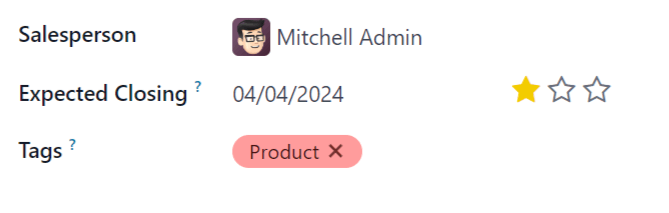
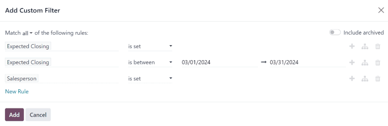

=======================
Expected revenue report
=======================

*Expected Revenue* is the total cash value of leads that are expected to close by a certain date,
usually the end of the current month.

An *expected revenue report* compiles all active leads in a sales pipeline that have a set expected
closing date, and compares how sales teams are performing in a given month.

By pulling a monthly expected revenue report, sales managers can see which team members are reaching
goals, and which may need additional assistance to close valuable deals.

Create an expected revenue report
=================================

To create an expected revenue report, first navigate to :menuselection:`CRM app --> Reporting -->
Pipeline`. This opens the :guilabel:`Pipeline Analysis` report.

.. important::
   The *Pipeline Analysis* report includes several filters in the search bar by default. Remove
   these before adding any additional custom filters.

On the top-left of the report, click :guilabel:`Measures`, then select :guilabel:`Expected Revenue`
from the drop-down menu.

At the top of the page, click the :guilabel:`down arrow` icon to the right of the search bar to open
the :guilabel:`Filters` drop-down menu. Select :guilabel:`Add a Custom Filter`.

Add custom filters
------------------

On the :guilabel:`Add Custom Filter` pop-up window, click into the first field of the new rule.
Type `Expected Closing` into the search bar, or scroll to select it from the list. Click in the
second field and select :guilabel:`is set`.

Click the :guilabel:`➕ (plus)` icon to the right of the rule to duplicate it.

Click the second field of the new rule, and select :guilabel:`is between` from the drop-down menu.
Click in the date fields and use the calendar drop-down to add a start and end date. This is usually
the beginning and ending of the current month.

Click :guilabel:`New Rule`. Click in the new rule's first field, then type `Salesperson` in the
search bar, or scroll through the list to select it. Click in the rule's second field and select
:guilabel:`is set` from the drop-down menu. This excludes any results without an assigned
salesperson.

         report.

.. important::
   At the top of the :guilabel:`Add Custom Filter` form, there is an option to match :guilabel:`any`
   or :guilabel:`all` of the rules. In order to properly run the report, only records that match
   **all** of the following filters should be included. Before adding the filters, make sure
   :guilabel:`all` is selected in this field.

   .. image:: expected_revenue_report/match-all-filters.png
      :align: center
      :alt: Emphasis on the match all filters option on the Add Custom Filter pop-up window.

At the bottom of the :guilabel:`Add Custom Filter` form, click :guilabel:`Add`.

Save as a favorite
------------------

To save this report as a favorite, click on the :guilabel:`down arrow` icon to the right of the
search bar, then click :guilabel:`Save current search`. Enter a name for this report, then click
:guilabel:`Save`.

.. tip::
   Before saving, additional selections can be made from this drop-down menu. For example, to view
   expected revenue by individual salespeople, selected :guilabel:`Salesperson` under the
   :guilabel:`Group By` heading.

View options
============

The expected revenue report benefits from utilizing multiple views. The default graph view can be
used to identify which salespeople are expected to bring in the most revenue, while the list view
and pivot view provide more detail on specific deals.

.. tabs::

   .. tab:: Graph view

      The *graph view* is used to visualize data, and is beneficial in identifying patterns and
      trends.

      *Bar charts* are used to show the distribution of data across several categories or among
      several salespeople.

      *Line charts* are useful to show changing trends over a period of time.

      *Pie charts* are useful to show the distribution, or comparison, of data among a small number
      of categories or salespeople, specifically how they form the meaningful part of a whole
      picture.

      The default view for the expected revenue report is the bar chart, stacked. To change to a
      different graph view, click one of the icons at the top-left of the report. While both the
      line chart and bar chart are available in stacked view, the pie chart is not.

      .. figure:: expected_revenue_report/graph-view-icons.png
         :align: center
         :alt: Close up view of the graph icons on the Pipeline analysis report in the CRM app.

         Graph view icons in order: bar chart, line chart, pie chart, stacked.

   .. tab:: List view

      The *list view* provides a list of all leads that are expected to close by the designated
      date. Clicking on a lead in list view opens the record for detailed analysis, but many
      insights can be gleaned from the basic view.

      To switch to the list view, click the :guilabel:`≣ (bars)` icon at the top-right of the
      report.

      .. image:: expected_revenue_report/list-icon.png
         :align: center
         :alt: Close up of the list view icon in the CRM app.

      To add additional metrics to the report, click the *additional options menu* indicated by the
      :guilabel:`sliders` icon at the top-right of the list. Select any additional metrics from the
      drop-down menu to add them to the list view. Some options that may be useful are
      :guilabel:`Expected Closing` and :guilabel:`Probability`.

   .. tab:: Pivot view

      The *pivot view* arranges all leads that are expected to close by the designated date into a
      table, with salespeople along the Y axis and stages along the X axis.

      To switch to the pivot view, click the :guilabel:`Pivot` icon at the top-right of the report.

      .. image:: expected_revenue_report/pivot-view-icon.png
         :align: center
         :alt: Close up of the pivot view icon in the CRM app.

      To add additional measures to the report, click the :guilabel:`Measures` button at the
      top-left of the report. Select any additional metrics from the drop-down menu.

      Click :guilabel:`Insert in Spreadsheet` to add the pivot view into an editable spreadsheet
      format within the *Dashboards* app. If the Odoo *Documents* app is installed, the report can
      be inserted into a blank or existing spreadsheet, and exported.
